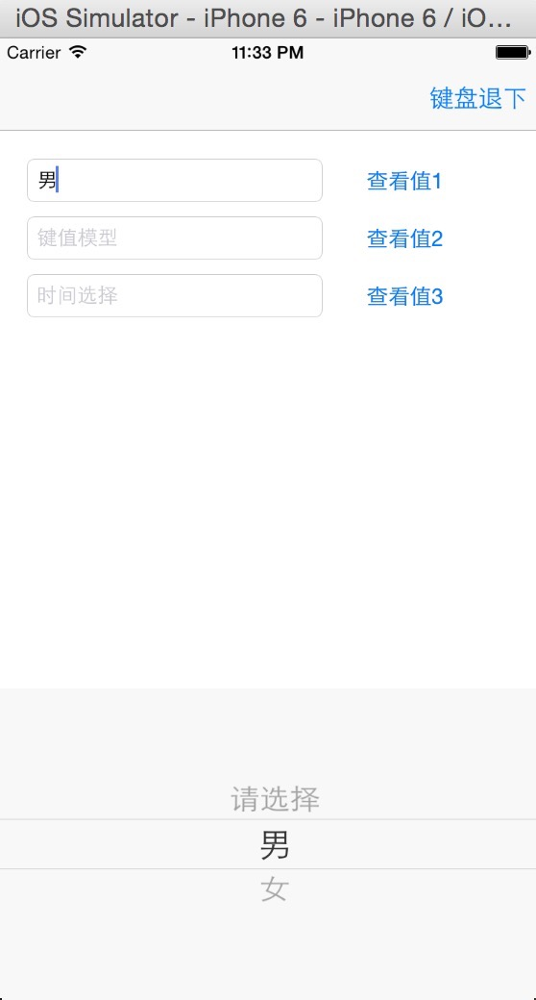
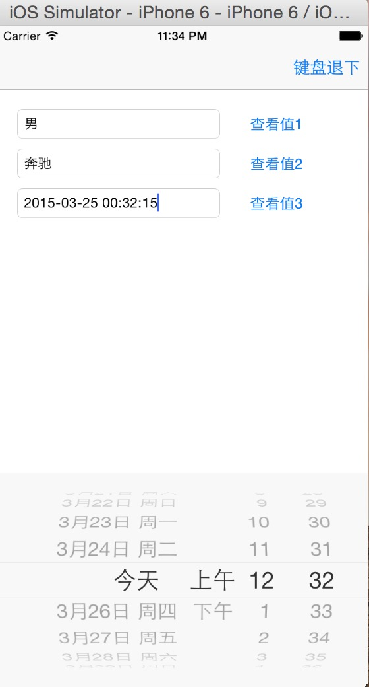
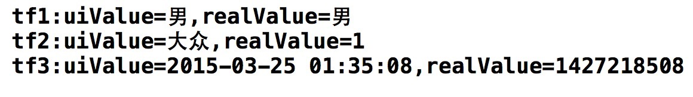

    Charlin出框架的目标：简单、易用、实用、高度封装、绝对解耦！

# CorePickerView
    极简选取器，一安一取，简单方便！
 
####框架特性： 
>1.极大程度的封装了pickerView和datePickerView。 
>2.使用无需记录成员变量，直接安装，直接使用。 
>3.扩展了UITextField,使用方便，便于理解，textField安装，textField取值，逻辑十分合理。 
>4.考虑了数据来源服务器的情况，对键值对式的pickerView做了比较好的处理。 
>5.加入了选取首行提示，更加友好。 
>6.无需麻烦的代理，事件监听，无需手动设置textField的值，无需复杂计算键值对应取值，全部已经搞定。 
>7.根据业务需要，目前支持普通单列/键值单列/时间选取，后续会持续完善其他功能，并尽量大统一API。 

  
####使用示例： 
     #import "UITextField+PicerView.h"

       普通单列
       安装：
    //创建模型
    Core1PickerModel *pickerModel=[Core1PickerModel pickerModel:@[@"男",@"女"]];
    
    //创建pickerView
    Core1PickerView *sexPicerView=[Core1PickerView pickerView:pickerModel];
    
    [_tf1 add1PickerView:sexPicerView];
    
    读取：
    NSString *uiValue=_tf1.input1pickerView.selectedUIValue;
    NSString *realValue=_tf1.input1pickerView.selectedRealValue;
    
    NSLog(@"tf1:uiValue=%@,realValue=%@",uiValue,realValue);
    
    
    
    键值单列：
    安装：
    Core1KeyValueObj *obj1= [Core1KeyValueObj obj:1 content:@"大众"];
    Core1KeyValueObj *obj2= [Core1KeyValueObj obj:2 content:@"宝马"];
    Core1KeyValueObj *obj3= [Core1KeyValueObj obj:3 content:@"奔驰"];
    Core1KeyValueObj *obj4= [Core1KeyValueObj obj:4 content:@"福特"];

    //建立模型
    Core1PickerModel *pickerModel=[Core1PickerModel pickerModel:@[obj1,obj2,obj3,obj4]];
    
    //建立pickerView
    Core1PickerView *pickerView=[Core1PickerView pickerView:pickerModel];
    
    //添加
    [_tf2 add1PickerView:pickerView];
    
    读取：
    NSString *uiValue=_tf2.input1pickerView.selectedUIValue;
    NSString *realValue=_tf2.input1pickerView.selectedRealValue;
    
    NSLog(@"tf2:uiValue=%@,realValue=%@",uiValue,realValue);
    
    
    
    
    日期选取：
    安装：
    //建立datePicker
    CoreDatePicker *datePicker=[CoreDatePicker datePicker:@"yyyy-MM-dd HH:mm:ss"];
    
    [_tf3 addDatePickerView:datePicker];
    
    
    读取：
    NSString *uiValue=_tf3.datePicker.selectedUIValue;
    NSString *timeStamp=_tf3.datePicker.selectedRealValue;
    
    NSLog(@"tf3:uiValue=%@,realValue=%@",uiValue,timeStamp);

####效果图： 
  
  
  
  
-----
    CorePickerView 极简选取器，一安一取，简单方便！
-----

  

#### 版权说明 RIGHTS  
作品说明：本框架由iOS开发攻城狮Charlin制作。 
作品时间： 2013.03.11 11:07 

#### 关于Chariln INTRODUCE  
作者简介：Charlin-四川成都华西都市报旗下华西都市网络有限公司技术部iOS工程师！  

#### 联系方式 CONTACT  
Q    Q：1761904945（请注明缘由） 
Mail：1761904945@qq.com 

